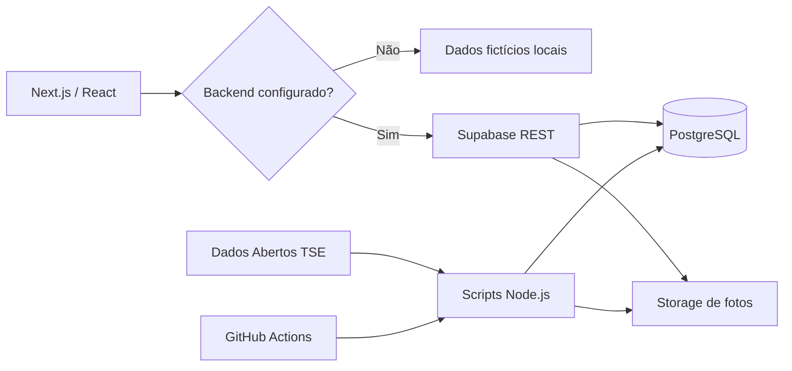

# Colinha 2026

> Projeto open source demonstrativo de uma aplicação eleitoral neutra para organizar números de candidaturas, gerar uma cola em imagem e treinar a sequência de votação em um simulador educativo.

Desenvolvido pela **Infofast**.

Este repositório foi preservado como projeto de portfólio e referência técnica. O backend original em Supabase não é necessário para conhecer ou executar a aplicação: **sem variáveis de ambiente, o frontend entra automaticamente em modo demonstração com dados fictícios locais**.

> **Aviso:** este projeto não é oficial, não pertence ao TSE e não recomenda, classifica ou sugere candidaturas.

## O que o projeto demonstra

- seleção dos 26 estados + Distrito Federal;
- tratamento específico de Deputado Distrital no DF;
- busca de candidaturas por UF, cargo e número;
- integração opcional com Supabase;
- importação dos Dados Abertos do TSE;
- uso das informações complementares para situação de urna e substituições;
- fotos de candidaturas em Supabase Storage;
- geração de uma cola eleitoral em PNG no navegador;
- compartilhamento por link, WhatsApp e Web Share API;
- simulador educativo com branco, nulo, legenda, CORRIGE e CONFIRMA;
- duas vagas para Senado;
- PWA / instalação no dispositivo;
- RLS no Supabase;
- automações manuais com GitHub Actions;
- funcionamento independente do backend em modo demonstração.

## Modo demonstração

Clone o repositório, instale as dependências e execute:

```bash
npm install
npm run dev
```

Abra:

```text
http://localhost:3000
```

Nenhum banco é necessário.

Quando `NEXT_PUBLIC_SUPABASE_URL` e `NEXT_PUBLIC_SUPABASE_ANON_KEY` não estão configurados, o projeto usa dados fictícios locais.

### Números para testar

| Cargo | Número |
| --- | ---: |
| Deputado Federal | `1234` |
| Deputado Estadual / Distrital | `12345` |
| Senador — 1ª opção | `123` |
| Senador — 2ª opção | `124` |
| Governador | `12` |
| Presidente | `13` |

Os nomes exibidos nesse modo são explicitamente demonstrativos e não representam pessoas ou candidaturas reais.

## Stack

- **Next.js 16**
- **React 19**
- **JavaScript**
- **Supabase / PostgreSQL**
- **Supabase Storage**
- **GitHub Actions**
- **Vercel**
- **Canvas API**
- **Web Share API**
- **PWA / Service Worker**

## Arquitetura



A camada `app/lib/candidateSource.js` decide automaticamente entre a fonte Supabase e o modo demonstração.

## Estrutura do projeto

```text
colinha/
├─ app/
│  ├─ components/
│  ├─ dados/
│  ├─ lib/
│  │  ├─ candidateSource.js
│  │  └─ states.js
│  ├─ privacidade/
│  ├─ simulador/
│  ├─ sobre/
│  ├─ layout.js
│  ├─ page.js
│  └─ style.css
├─ public/
├─ scripts/
│  ├─ import-tse.mjs
│  ├─ import-photos.mjs
│  └─ README.md
├─ supabase/
│  ├─ schema.sql
│  ├─ seed-demo.sql
│  └─ README.md
├─ .github/workflows/
├─ .env.example
└─ LICENSE
```

## Usando seu próprio Supabase

### 1. Crie um projeto

Crie um projeto novo no Supabase.

### 2. Monte o banco

Abra o SQL Editor e execute:

```text
supabase/schema.sql
```

O script cria:

- tabela `public.candidates`;
- índices de busca;
- campos de situação eleitoral;
- Row Level Security;
- policy pública somente para leitura;
- bucket público `candidate-photos`.

### 3. Configure o frontend

Copie:

```text
.env.example
```

para:

```text
.env.local
```

e preencha:

```env
NEXT_PUBLIC_SUPABASE_URL=https://SEU-PROJETO.supabase.co
NEXT_PUBLIC_SUPABASE_ANON_KEY=SUA_CHAVE_PUBLICA
NEXT_PUBLIC_DEMO_MODE=false
```

A chave pública/anon pode ser usada no navegador porque o controle de acesso deve ser feito por RLS.

**Nunca coloque a `SUPABASE_SERVICE_ROLE_KEY` no frontend.**

### 4. Seed opcional

Para testar um banco recém-criado sem importar o TSE:

```text
supabase/seed-demo.sql
```

## Importando dados do TSE

O projeto inclui scripts para reconstruir a base a partir dos arquivos oficiais.

Os detalhes estão em:

```text
scripts/README.md
```

Fluxo:

1. baixar `consulta_cand_2026.zip`;
2. baixar `consulta_cand_complementar_2026.zip`;
3. executar `scripts/import-tse.mjs`;
4. baixar os ZIPs de fotos por UF;
5. executar `scripts/import-photos.mjs --uf=XX`.

Fonte original:

- [Dados Abertos do TSE — Candidatos 2026](https://dadosabertos.tse.jus.br/dataset/candidatos-2026)

O projeto usa o identificador `SQ_CANDIDATO` para relacionar candidatura e foto.

## Situação de urna e substituições

Um desafio importante do protótipo foi lidar com números que aparecem mais de uma vez no conjunto histórico de candidaturas.

Para isso, o importador também lê o arquivo de **informações complementares** e armazena campos como:

- inserido na urna;
- substituído;
- situação no pleito;
- situação na urna;
- destinação de votos;
- situação de julgamento.

No frontend, quando existe backend real, a consulta usa somente registros marcados como:

```text
inserted_in_urn = true
is_substituted = false
```

Isso evita que registros históricos substituídos sejam tratados como a candidatura atual do número.

## Fotos

As fotos ficam no bucket:

```text
candidate-photos
```

Estrutura utilizada:

```text
2026/{UF}/{SQ_CANDIDATO}.jpg
```

O importador possui:

- paginação dos candidatos;
- concorrência controlada;
- retry com espera progressiva;
- `upsert` dos arquivos.

## Privacidade

O projeto não precisa criar uma tabela de escolhas do usuário.

A cola é montada no navegador. O compartilhamento usa:

- UF na query string;
- números identificados no fragmento `#` da URL.

Exemplo conceitual:

```text
/?uf=PB#depFederal=1234&senador1=123
```

O fragmento não é enviado ao servidor na requisição HTTP inicial.

## Simulador

O simulador é **educativo** e não pretende reproduzir oficialmente a urna eletrônica.

Ele demonstra:

- ordem dos cargos;
- quantidade de dígitos;
- consulta por número;
- voto de legenda para cargos proporcionais;
- branco;
- nulo;
- correção;
- confirmação;
- duas vagas para Senado;
- áudio final de confirmação.

## GitHub Actions

Os workflows foram mantidos no repositório como referência, mas estão configurados para execução **manual**.

Em um fork, crie os repository secrets:

```text
SUPABASE_URL
SUPABASE_SERVICE_ROLE_KEY
```

Depois execute as sincronizações pela aba **Actions**.

## Deploy

O projeto pode ser publicado diretamente na Vercel.

Sem variáveis do Supabase, o deploy continuará funcional em **modo demonstração**.

Com backend:

```text
NEXT_PUBLIC_SUPABASE_URL
NEXT_PUBLIC_SUPABASE_ANON_KEY
```

podem ser configuradas nas Environment Variables do projeto.

## Segurança

- a service role não é usada pelo frontend;
- RLS fica habilitado;
- usuários anônimos recebem somente `SELECT` em `candidates`;
- importações administrativas usam a service role;
- não há persistência de escolhas eleitorais;
- o modo demonstração dispensa credenciais.

## Contexto do projeto

O Colinha nasceu como um projeto prático durante as Eleições de 2026 e foi evoluindo de um protótipo focado na Paraíba para uma implementação nacional.

Entre os problemas técnicos trabalhados estão:

- importação de milhares de registros;
- fotos por UF;
- estados com grandes volumes de candidatos;
- registros substituídos;
- números duplicados no conjunto histórico;
- compartilhamento sem salvar escolhas;
- geração de imagens no frontend;
- funcionamento offline/demonstrativo após o encerramento do backend original.

Hoje o repositório é mantido principalmente como **projeto de portfólio, estudo e referência open source**.

## Contribuições e forks

Fique à vontade para:

- fazer fork;
- adaptar o layout;
- usar outro backend;
- atualizar para eleições futuras;
- substituir a fonte de dados;
- estudar a arquitetura e os scripts.

Se reutilizar o projeto, mantenha os avisos e atribuições exigidos pelas respectivas fontes de dados e bibliotecas.

## Autor

**Gleison Tiago Martins de Araújo**  
Desenvolvido pela **Infofast**

GitHub: [@GLEISONtiago](https://github.com/GLEISONtiago)

## Licença

Código distribuído sob a licença **MIT**. Consulte [LICENSE](LICENSE).

Os dados eleitorais e imagens eventualmente importados não fazem parte da licença do código deste repositório e permanecem sujeitos às condições da fonte original.

---

Se este projeto te ajudou como referência de Next.js, Supabase, importação de dados ou PWA, uma ⭐ no repositório é bem-vinda.
